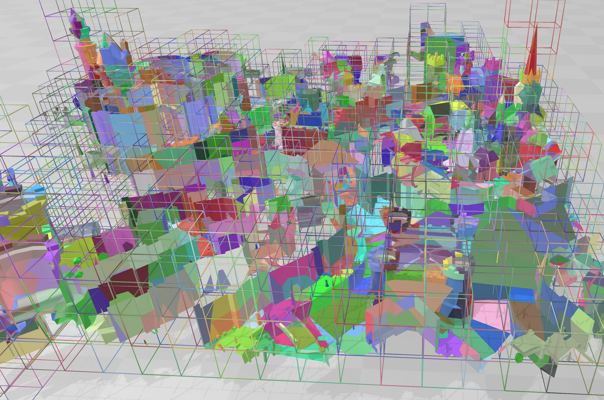

<h1>PartitionedMesh</h1>

<h3>Overview:</h3>
The project purpose is to compress 3D mesh along with an Octree structure in which each node contains a list of overlapping triangles; which I’d like to call <b>OctreeMesh</b>. 
This then can be saved to disk and be loaded in 168ms for raycasting.  

The results of the 3D mesh file that consists of 71507 triangles and 40550 vertices which would be: 
71507 x (4 bytes* 3) + 40550 x (4 byte * 3) =  1314 kb. 
The OctreeMesh file results in 268 kb: 
  - 204 kb compressed mesh  
    - 15% of original size mesh size  
    - Encoded by using OpenCtm techniques  
- 64 kb Octree structure (1487 nodes, 112713 triangle connections) 
    - 4.54 bit per triangle connection. 
	

<h3>Usage areas:</h3>
The most suitable usage is for large 3D static mesh, for example a city or large area. 
When raycasting it uses octree structure to check which node bounds the ray intersects with and checks the containing triangles for intersection.  
Instead of creating nodes for each triangles which would be ineffective and take a lot of storage, it stores the nodes in a specified node cell size. Using larger cell size results in smaller file size but slower query and vice versa.  

For very large mesh I've also added Bounding volume hierarchy (BVH) support, so you can easily use multiple OctreeMesh’s and can be queried more effectively. 
The BVH and the containing OctreeMesh’s can be saved on disk with only 33 kb overhead with 8 OctreeMesh nodes.  

<h3>Octotree structure:</h3>
To be able to create nodes with a specific cell size the root needs to be able to be recursively divided by 8; the initial root size is calculated by taking the size and doubling it until it reaches above a size dimension.  
<h4>The Octree nodes position:</h4>
Nodes position is saved using grid indices instead of 3 float values, the grid is created by using the specified cell size, then saving the grid index by VLC 7 bit encoding and how many children it has. 

<h4>The nodes triangle list is compressed by:</h4>
1. Nodes store the index of each triangle to the mesh triangle list. 
2. Each node’s connectivity indices are sorted and delta encoded. 
3. Reorder nodes in ascending order as per first element value. 
4. Extract the first element from each node to a list and apply delta encoding. 
5. Nodes lists is flatten into one and the list extracted from the first element is both encoded by: 
&emsp; - Run-Length Encoding (RLE)  
&emsp; - Variable Length Coding (VLC) with a 3 bit + 1 scheme 
&emsp; - LMZA 
 
